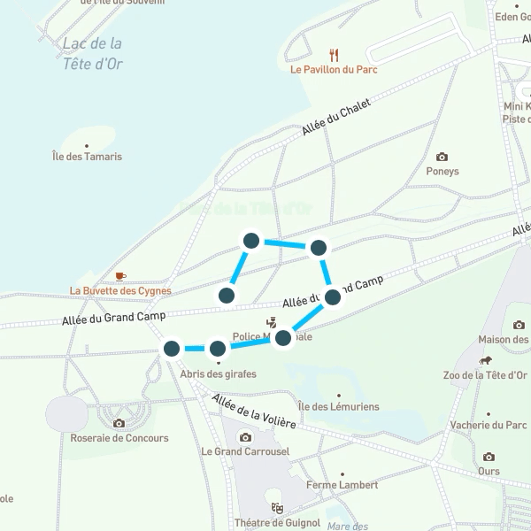

# LIFPROJET
Ce projet consiste en la conception d’un site internet permettant de visualiser et de modifier en temps réel une trace GPS.

## Installation:
Pour compiler le projet :
En mode dev :
```
$ npm i
$ npm run dev
```

En mode production :
```
$ npm i
$ npm run prod
```

En cas d'erreur avec node-sass :
```
$ npm update
$ npm install
$ nodejs node_modules/node-sass/scripts/install.js
$ npm rebuild node-sass
```
Il arrive parfois que le fichier install du paquet node-sass ne s'éxecute pas lors du premier build à cause d'un problème de permissions.

## Composantes
* Webpack : module bundler
* NodeJS + Express : serveur web

* Framework : AngularJS
* Librairies :
	1. Leaflet
	2. Mapbox
	3. ApexCharts

## Outils:
### Insertion de points 
Cet outil permet d'ajouter un point à votre itinéraire GPS. Il est possible de cliquer sur le tracé pour ajouter votre point entre deux autres. Lors de l'ajout d'un point, il est possible de le déplacer avec le curseur.


### Suppression d'un point 
Cet outil permet de supprimer un point de votre itinéraire GPS.


### Déplacement et fusion de points 
Cet outil permet de déplacer un point déjà présent sur votre itinéraire GPS. Il est possible de fusionner deux points consécutifs en déplaçant un des points vers le deuxième. Si les deux points ne sont pas consécutifs alors les deux points subsistent et sont modifiables individuellement (cela permet par exemple de créer un cycle).


### Simplification locale de points 
Cet outil permet de réduire localement le nombre de points de votre itinéraire GPS.


### Simplification globale de points 
Cet outil permet de réduire globalement le nombre de points de votre itinéraire GPS.


### Raccourci 
Cet outil permet de réduire localement votre itinéraire GPS en indiquant deux points.


### Effacer 
Cet outil permet d'effacer votre itinéraire GPS.



## Fonctionnalités :
### Altitude
Un graphique présente l'évolution de l'altitude du tracé. Le graphique évolue dynamiquement en même temps que le tracé.

### Historique de tracé
Deux bouttons *undo* et *redo* permettent de revenir en arrière ou en avant. L'historique mémorise la trace, les métadonnées et le zoom de la map.

### Mise en cache des tiles
Les *tiles* (images) qui constituent la carte sont mises en cache dans le navigateur de l'utilisateur afin d'optimiser un futur chargement de la page.

### Importation d'un fichier GPX
Le module d’importation de trace offre deux options :

* importer une trace via un lien
* importer une trace via un fichier personnel

Le seul format de fichier accepté est le .gpx

L’importation tient compte des métadonnées présentent au sein du fichier (nom de la trace, description de la trace, auteur, email, nom, etc…)

### Exportation d'une trace
Le module d’exportation permet à l’utilisateur de sauver une copie de sa trace GPS. Le fichier GPX généré est en version 1.1 (dernière norme en date). L’exportation classique ne tient pas compte des métadonnées contrairement à l’exportation avancée. Les métadonnées sont modifiables à tout moment, il est possible de renseigner :

* le nom de la trace
* la description de la trace
* l'identité de l'auteur
* l'email de l'auteur

Si l'email de l'auteur est renseigné par l'utilisateur, il est possible de reçevoir la trace par email au moment d'enregistrer le fichier.

L’importation et l’exportation s’effectue du côté client de l’application. Cela permet de soulager le serveur Node.js du traitement des fichiers GPX et de garantir le respect de la confidentialité des utilisateurs et de leurs données.

## Changelog :
###10/02/2020 :
* Création du projet (Webpack, NodeJS, Express, SCSS, Typescript)
* Ajout du readme.md

###18/02/2020 :
* Ajout du framework AngularJS
* Intégration des librairies Leaflet et Mapbox

###21/02/2020 :
* Ajout du plugin Leaflet.TileLayer.PouchDBCached pour la mise en cache des tiles de la map

###25/02/2020 :
* Intégration de la librairie ApexCharts pour afficher le graphe des altitudes
* Ajout de l'outil Ajouter
* Ajout de l'outil Déplacer
* Ajout de l'outil Lasso

###07/03/2020 :
* Ajout de l'outil Suppression
* Actualisation du graphe en temps réel avec la trace

###13/03/2020 :
* Amélioration de l'outil Lasso
* Ajout des curseurs personnalisés

###16/03/2020 :
* Ajout de l'historique et des deux boutons *undo* et *redo*
* Ajout de la possibilité de fusionner deux points consécutifs

###22/03/2020 :
* Ajout du plugin Leaflet.Hotline pour afficher un dégardé sur la polyline
* Ajout du mode production sur Webpack

###23/03/2020 :
* Ajout du gestionnaire de processus PM2 pour maintenir le serveur en ligne
* Mise en ligne du projet à l'adresse : lif.sci-web.net:8080

###26/03/2020 :
* Ajout du module d'importation d'une trace GPS via un lien ou un fichier GPX

###27/03/2020 :
* Ajout du module de notifications
* Ajout de l'outil Correcteur

###28/03/2020 :
* Optimisation de l'UI/UX
* Enrichissement des informations de la trace
	1. Altitude min.
	2. Altitude max.
	3. Altitude moy.
	4. Coordonnées du curseur
* Copie d'une coordonnée dans le presse-papier
* Ajout d'une jauge pour contrôler le zoom de la map

###30/03/2020 :
* Ajout du module d'exportation d'une trace GPS en un fichier GPX
* Ajout de l'outil Géolocalisation

###31/03/2020 :
* Ajout de la possibilité de sélectionner un point et de consulter ses coordonnées et son altitude
* Amélioration de l'outil Correcteur

###04/04/2020 :
* Ajout de la documentation des outils, chaque outil est illustré par un GIF
* Un message d'erreur apparaît si le navigateur refuse la géolocalisation sans certificat SSL
* Optimisation des performances avec Lighthouse de Google
	1. 	Ajout d'un service worker
	2. Compression gzip du texte
	3. Amélioration de la mise en cache
	4. Compatibilité Progressive Web App : le site internet peut être ajouté comme application sur smartphone

###05/04/2020 :
* Amélioration de l'interface de l'outil Correcteur
* Correction d'un bug de l'outil Lasso
* Nouvel ouitl Raccourci
* Nouvel outil Effacer

###07/04/2020 :
* Prise en charge des métadonnées en lien avec une trace GPS
* Les métadonnées sont prises en compte lors d'une importation
* Ajout de l'exportation avancée qui permet de sauver les métadonnées au sein du fichier GPX
* Ajout du package Cookie Consent pour être en conformité avec la RGPD européenne

###08/04/2020 :
* Amélioration des performances
* Une barre de chargement représente le chargement de la map

###11/04/2020 :
* Ajout de l'exportation d'une trace par mail avec NodeMailer et Gmail
* Interface pleinement adaptée aux petis écrans (mobile)